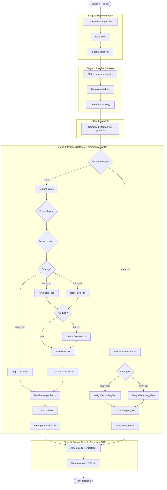

# hydro-param Pipeline Flowchart

## Data Flow Summary

| Stage | Input | Output | Key Module |
|-------|-------|--------|------------|
| 1 | GeoPackage path + bbox | GeoDataFrame with `batch_id` | `pipeline.py`, `batching.py` |
| 2 | Dataset names from config | `(DatasetEntry, DatasetRequest, [VarSpec])` tuples | `dataset_registry.py` |
| 3 | *(internal to gdptools)* | Spatial weights | gdptools |
| 4 | Fabric + resolved datasets | `Stage4Results` + per-variable/temporal files written to disk | `processing.py`, `data_access.py`, `pipeline.py` |
| 5 | Stage4Results + config | Combined SIR `.nc` → `PipelineResult` | `pipeline.py` |

## Processing Strategy Matrix

| Strategy | gdptools Class | Static/Temporal | Batched? | Path |
|----------|---------------|----------------|----------|------|
| `stac_cog` | `UserTiffData` | Static | Yes (spatial) | fetch raster - GeoTIFF - `ZonalGen` |
| `local_tiff` | `UserTiffData` | Static | Yes (spatial) | load local - GeoTIFF - `ZonalGen` |
| `nhgf_stac` (static) | `NHGFStacTiffData` | Static | Yes (spatial) | direct - `ZonalGen` |
| `nhgf_stac` (temporal) | `NHGFStacData` | Temporal | No (full fabric) | `WeightGen` - `AggGen` |
| `climr_cat` | `ClimRCatData` | Temporal | No (full fabric) | `WeightGen` - `AggGen` |
