# Phase 1 Pipeline Flow Reference

This document is the canonical visual reference for the **Phase 1 (generic, model-agnostic) pipeline**. It covers every stage from configuration loading through SIR normalization, with Mermaid diagrams and code-location references.

The pipeline is implemented in `src/hydro_param/pipeline.py` and orchestrated by `run_pipeline_from_config()` (line 1008). It knows nothing about any target model — all model-specific logic lives in plugins.

## Overview

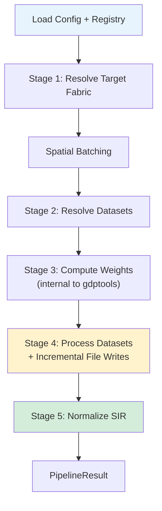

**Entry points:**

| Function | Location | Purpose |
|----------|----------|---------|
| `run_pipeline()` | `pipeline.py:1106` | Load config/registry from paths, then delegate |
| `run_pipeline_from_config()` | `pipeline.py:1008` | Execute stages 1–5 from pre-loaded objects |

---

## Stage 1: Resolve Target Fabric

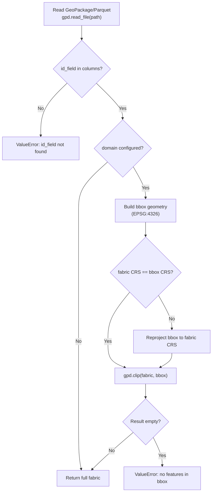

**Function:** `stage1_resolve_fabric()` at `pipeline.py:154–190`

Loads the target fabric (a pre-existing GeoPackage or GeoParquet file) and validates that the configured `id_field` exists. If a `domain.bbox` is set in the config, the fabric is spatially clipped to that bounding box. The bbox is assumed EPSG:4326 and is reprojected to the fabric's native CRS if they differ (`pipeline.py:183–184`).

hydro-param does **not** fetch or subset fabrics — the input file must already exist. Use pynhd/pygeohydro upstream to obtain it.

**Config model:** `TargetFabricConfig` at `config.py:17–22`, `DomainConfig` at `config.py:25–38`

---

## Spatial Batching

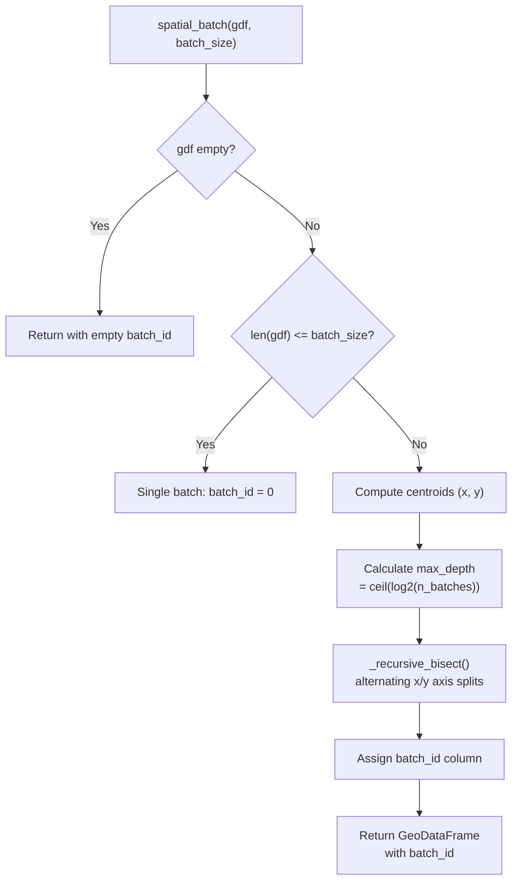

**Function:** `spatial_batch()` at `batching.py:64–135`

Groups features into spatially contiguous batches using KD-tree recursive bisection. This ensures each batch's bounding box is compact, enabling efficient raster subsetting. The algorithm:

1. Computes centroid coordinates for all features (`batching.py:103–107`).
2. Calculates recursion depth from `ceil(log2(n_features / batch_size))` (`batching.py:109–110`).
3. Recursively bisects along alternating x/y axes at the median coordinate (`_recursive_bisect()` at `batching.py:19–61`). Splitting stops when a partition has fewer features than `batch_size // 2` or the maximum depth is reached.
4. Assigns a `batch_id` integer column to the GeoDataFrame (`batching.py:119–124`).

The geographic CRS centroid warning is suppressed — approximate centroids are sufficient for spatial grouping (`batching.py:103–104`).

**Called from:** `run_pipeline_from_config()` at `pipeline.py:1047`

---

## Stage 2: Resolve Datasets

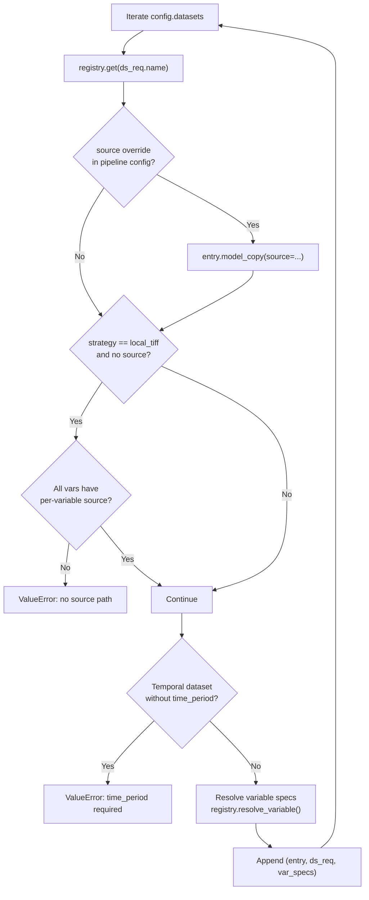

**Function:** `stage2_resolve_datasets()` at `pipeline.py:193–274`

Resolves each dataset name from the pipeline config against the dataset registry. For each dataset:

1. Looks up the `DatasetEntry` from the registry (`pipeline.py:206`).
2. Applies any pipeline-level `source` override (`pipeline.py:209–210`).
3. Validates that `local_tiff` datasets have a source path — either dataset-level or per-variable (`pipeline.py:213–256`). Error messages include download instructions when available.
4. Validates that temporal datasets have a `time_period` set (`pipeline.py:259–263`).
5. Resolves each requested variable name to a `VariableSpec` or `DerivedVariableSpec` (`pipeline.py:265`).

**Registry:** `load_registry()` in `dataset_registry.py`, config files in `configs/datasets/`

---

## Stage 3: Compute Weights

Stage 3 is handled internally by gdptools. For static datasets, `ZonalGen` computes intersection weights on the fly. For temporal datasets, `WeightGen` computes weights explicitly before aggregation.

hydro-param does not manage weights directly — gdptools handles CRS alignment, area-weighted overlaps, and engine selection. The pipeline simply logs:

```
Stage 3: Weights computed internally by gdptools
```

**Reference:** `pipeline.py:1065–1066`

---

## Stage 4: Process Datasets

Stage 4 is the core processing loop. It routes each dataset to either the static batch loop or the temporal processing path, writes output files incrementally, and optionally records a manifest for resume support.

### Top-Level Flow

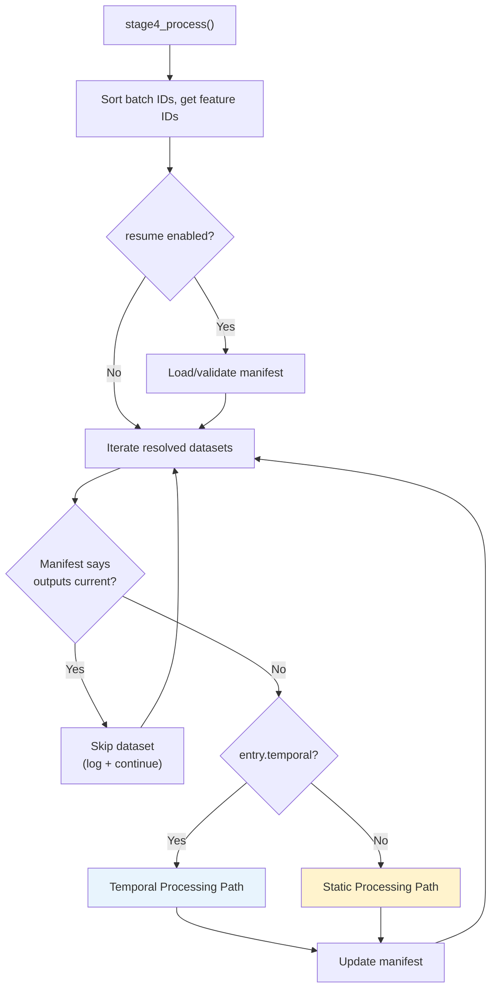

**Function:** `stage4_process()` at `pipeline.py:723–937`

The function iterates over all resolved datasets. For each one:

1. **Resume check** (`pipeline.py:789–804`): If resume is enabled and the manifest indicates the dataset's outputs are current (matching fingerprint + files exist), the dataset is skipped entirely.
2. **Route by type**: Temporal datasets go to `_process_temporal()`, static datasets go through the batch loop.
3. **Manifest update** (`pipeline.py:846–849`, `927–929`): After each dataset completes, the manifest is saved to disk for crash recovery.

### Static Processing Path

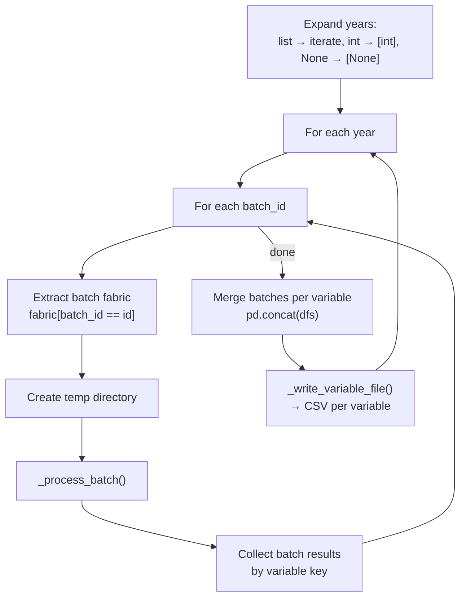

**Code path:** `pipeline.py:854–929`

Static datasets support multi-year processing via `ds_req.year` (can be a single int, a list, or None). Result keys are year-suffixed when multiple years are specified (e.g., `land_cover_2020`, `land_cover_2021`). Each year iterates over all spatial batches, accumulates per-variable DataFrames, then merges and writes a single CSV per variable.

**`_write_variable_file()`** (`pipeline.py:573–631`): Renames columns (`"mean"` → `var_name`, others → `var_name_{stat}`), reindexes to the full feature set (NaN for missing), sorts by ID, and writes CSV with `id_field` as the index.

### Temporal Processing Path

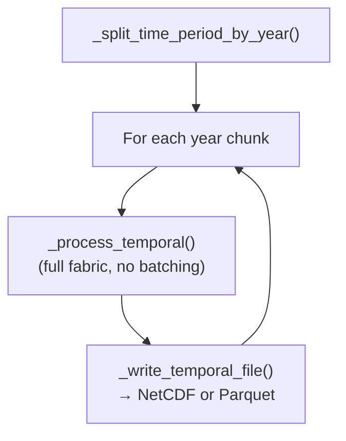

**Code path:** `pipeline.py:806–851`

Temporal datasets skip spatial batching entirely — they are processed full-fabric via gdptools `WeightGen` + `AggGen`. The time period is split into per-calendar-year chunks by `_split_time_period_by_year()` (`pipeline.py:544–570`) to keep file sizes manageable (e.g., `["2020-03-15", "2022-06-30"]` → 3 chunks).

**`_write_temporal_file()`** (`pipeline.py:634–674`): Writes NetCDF (`.nc`) or Parquet depending on `config.output.format`.

### _process_batch: Strategy Routing

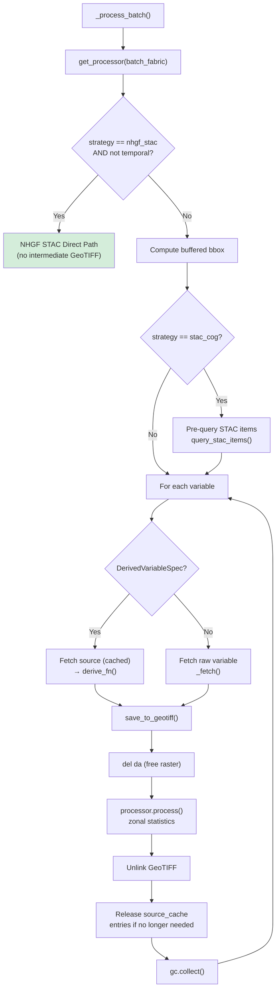

**Function:** `_process_batch()` at `pipeline.py:301–465`

This is the inner loop for static datasets. Key details:

- **NHGF STAC direct path** (`pipeline.py:323–340`): For `nhgf_stac` (non-temporal) datasets, gdptools reads COGs directly from the STAC catalog via `NHGFStacTiffData`. No intermediate GeoTIFF is created.
- **Buffered bbox** (`_buffered_bbox()` at `pipeline.py:277–298`): Adds a 2% buffer around batch bounds for edge coverage. Coordinates are converted to EPSG:4326 if the fabric uses a projected CRS.
- **STAC query reuse** (`pipeline.py:349–351`): For `stac_cog` datasets, `query_stac_items()` is called once per batch, and the result is passed to all subsequent `fetch_stac_cog()` calls via the `items` parameter.
- **Source cache** (`pipeline.py:346`): A `dict[str, xr.DataArray]` avoids redundant fetches when derived variables share a source (e.g., slope and aspect both derive from elevation).
- **Memory management** (`pipeline.py:446–463`): Source cache entries are released as soon as no remaining variable needs them. `gc.collect()` runs after each variable's zonal stats to keep the memory footprint sawtooth-shaped.

### Data Access Strategies

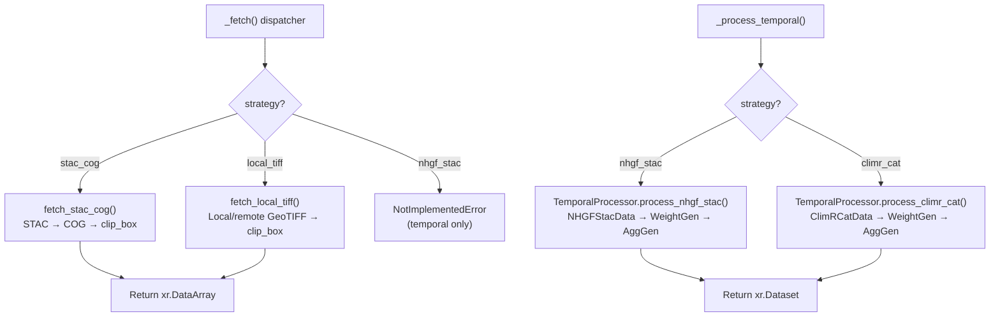

| Strategy | Module | Static Function | Temporal Function |
|----------|--------|----------------|-------------------|
| `stac_cog` | `data_access.py:242` | `fetch_stac_cog()` | — |
| `local_tiff` | `data_access.py:342` | `fetch_local_tiff()` | — |
| `nhgf_stac` (static) | `processing.py:156` | `ZonalProcessor.process_nhgf_stac()` | — |
| `nhgf_stac` (temporal) | `processing.py:275` | — | `TemporalProcessor.process_nhgf_stac()` |
| `climr_cat` | `processing.py:353` | — | `TemporalProcessor.process_climr_cat()` |

**`fetch_stac_cog()`** (`data_access.py:242–324`): Queries STAC, opens COGs via `rioxarray.open_rasterio()`, clips to bbox, and mosaics multiple tiles if needed.

**`fetch_local_tiff()`** (`data_access.py:342–460`): Opens a local file or remote HTTP URL via GDAL vsicurl. Supports per-variable source overrides (e.g., POLARIS VRTs).

**Derived variables** (`data_access.py:66–166`): `derive_slope()` and `derive_aspect()` compute terrain derivatives from elevation using Horn's method via `numpy.gradient`. Registered in `DERIVATION_FUNCTIONS` at `data_access.py:163–166`.

**Zonal statistics** (`processing.py:41–154`): `ZonalProcessor.process()` wraps gdptools `UserTiffData` + `ZonalGen`. It reads CRS from the registry (or the GeoTIFF if not specified), constructs a `ZonalGen` with the `exactextract` engine, and computes either continuous statistics or categorical class fractions.

### Resume Support

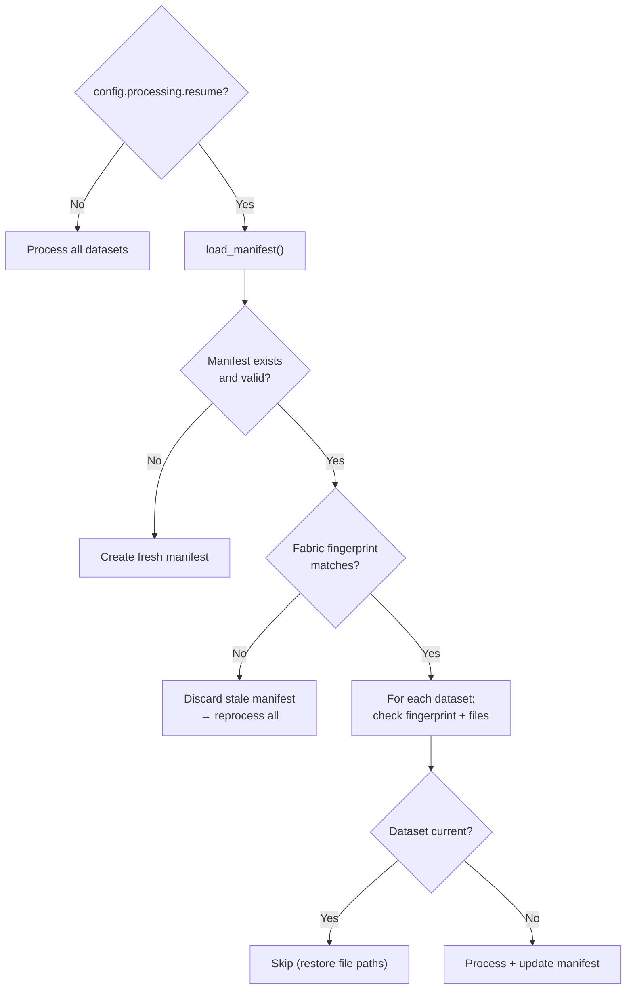

**Module:** `manifest.py`

The manifest system enables crash recovery by recording what config produced each output file. Key functions:

- `load_manifest()` (`manifest.py:105–128`): Loads `.manifest.yml` from the output directory. Returns `None` for missing or corrupt manifests.
- `fabric_fingerprint()` (`manifest.py:131–150`): Cheap `"filename|mtime|size"` proxy for content identity.
- `dataset_fingerprint()` (`manifest.py:153–214`): SHA-256 hash of all config fields that affect processing output.
- `is_dataset_current()` (`manifest.py:79–102`): Returns `True` only when the fingerprint matches AND all listed output files exist on disk.

---

## Stage 5: Normalize SIR

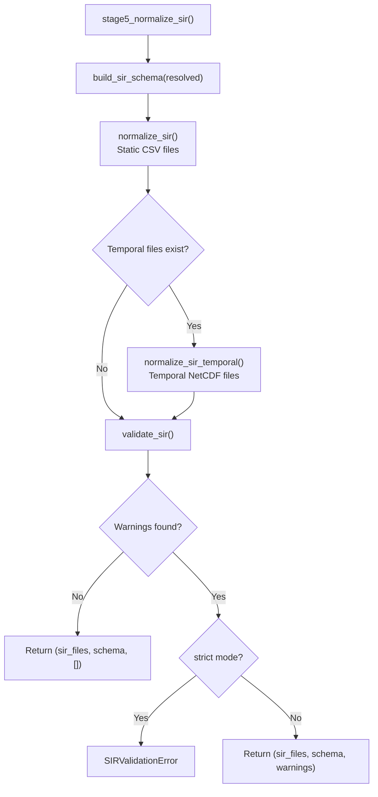

**Function:** `stage5_normalize_sir()` at `pipeline.py:940–1000`

Stage 5 transforms raw gdptools output (source names, source units) into the Standardized Internal Representation (SIR) with canonical variable names and units.

### Schema Generation

**`build_sir_schema()`** (`sir.py:127–202`) auto-generates the SIR schema from stage 2 resolved datasets. For each variable:

- **Categorical** variables get a `<base>_frac` canonical name (e.g., `land_cover_frac`). Fraction columns are generated dynamically during normalization.
- **Continuous** variables get `<base>_<unit_abbrev>_<stat>` names (e.g., `elevation_m_mean`). Year suffixes are appended for multi-year datasets.

### Static Normalization

**`normalize_sir()`** (`sir.py:234–387`) reads raw per-variable CSVs, renames columns to canonical SIR names, applies unit conversions, and writes normalized CSVs to `sir/`.

Unit conversions (defined in `_UNIT_TABLE` at `sir.py:29–47`):

| Source Units | Canonical Units | Conversion |
|-------------|----------------|------------|
| `log10(cm/hr)` | `cm/hr` | `10^x` |
| `log10(kPa)` | `kPa` | `10^x` |
| `K` | `°C` | `x - 273.15` |
| `m`, `%`, `cm`, etc. | passthrough | none |

### Temporal Normalization

**`normalize_sir_temporal()`** (`sir.py:390–474`) handles temporal NetCDF files. It looks up gdptools long names to map back to the SIR schema, applies unit conversions, and writes per-variable NetCDFs to `sir/`.

### Validation

**`validate_sir()`** (`sir.py:497–587`) checks:

1. **Completeness**: Every schema variable has a corresponding SIR file.
2. **NaN coverage**: Warns if any variable is 100% NaN (possible processing failure).
3. **Value range**: For variables with `valid_range` (e.g., categorical fractions must be in [0, 1]), warns on out-of-range values.

In **strict mode** (`config.processing.sir_validation == "strict"`), any warning raises `SIRValidationError`. Default is tolerant.

---

## Data Flow Summary

### Static Variable Lifecycle

```
YAML config
  → stage2: resolve to VariableSpec (name, units, categorical, asset_key)
  → stage4: for each batch:
      fetch raster → save GeoTIFF → ZonalGen → pd.DataFrame
      → merge batches → _write_variable_file() → raw CSV
  → stage5: normalize_sir() → canonical CSV in sir/
  → PipelineResult.load_sir() → xr.Dataset
```

**Files produced per static variable:**
- `output/{category}/{var_name}.csv` — raw zonal statistics (source names/units)
- `output/sir/{canonical_name}.csv` — normalized SIR (canonical names/units)

### Temporal Variable Lifecycle

```
YAML config
  → stage2: resolve to VariableSpec (name, units, long_name)
  → stage4: split time_period by year:
      for each year chunk:
        NHGFStacData/ClimRCatData → WeightGen → AggGen → xr.Dataset
        → _write_temporal_file() → raw NetCDF
  → stage5: normalize_sir_temporal() → canonical NetCDF in sir/
  → PipelineResult.load_sir() → xr.Dataset
```

**Files produced per temporal dataset:**
- `output/{category}/{dataset}_{year}_temporal.nc` — raw temporal output
- `output/sir/{canonical_name}_{year}.nc` — normalized SIR temporal output

### Key Data Types at Each Stage

| Stage | Input | Output |
|-------|-------|--------|
| 1 | Config YAML | `gpd.GeoDataFrame` (fabric) |
| Batching | GeoDataFrame | GeoDataFrame + `batch_id` column |
| 2 | Config + Registry | `list[(DatasetEntry, DatasetRequest, [VarSpec])]` |
| 3 | (internal) | Intersection weights (managed by gdptools) |
| 4 static | Batch fabric + VarSpecs | Per-variable CSVs (`pd.DataFrame` → disk) |
| 4 temporal | Full fabric + VarSpecs | Per-year NetCDFs (`xr.Dataset` → disk) |
| 5 | Raw files + Schema | Normalized SIR files + validation warnings |
| Result | All of the above | `PipelineResult` (file paths + lazy `load_sir()`) |
